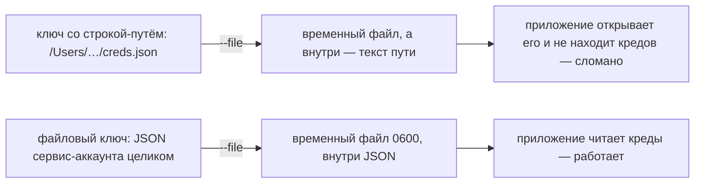
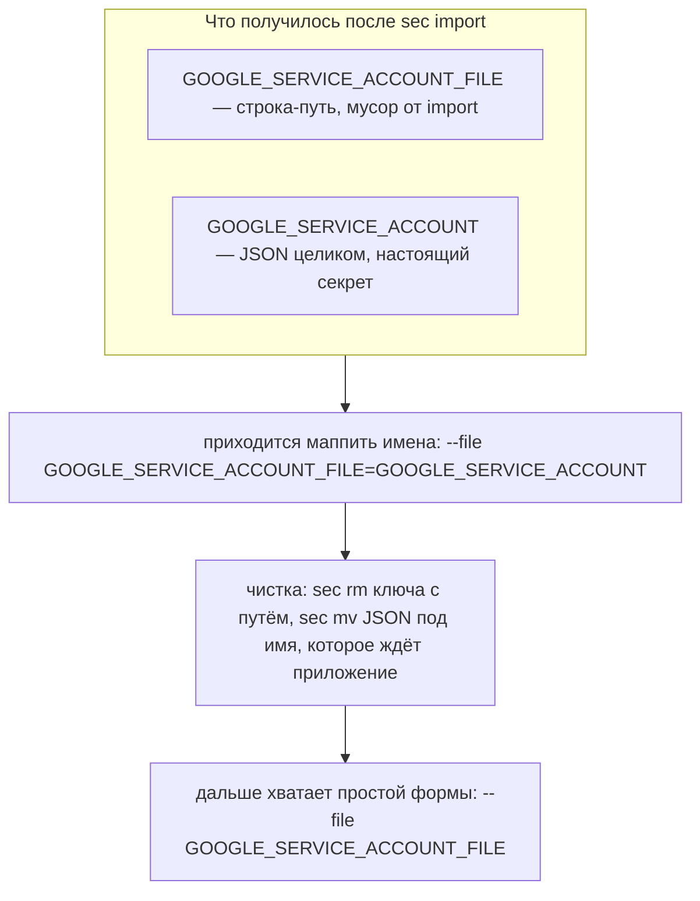
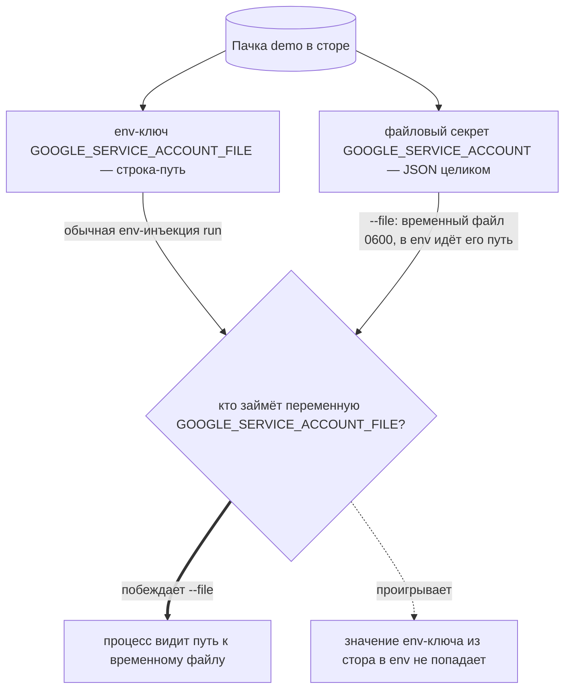
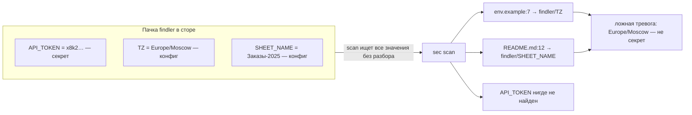
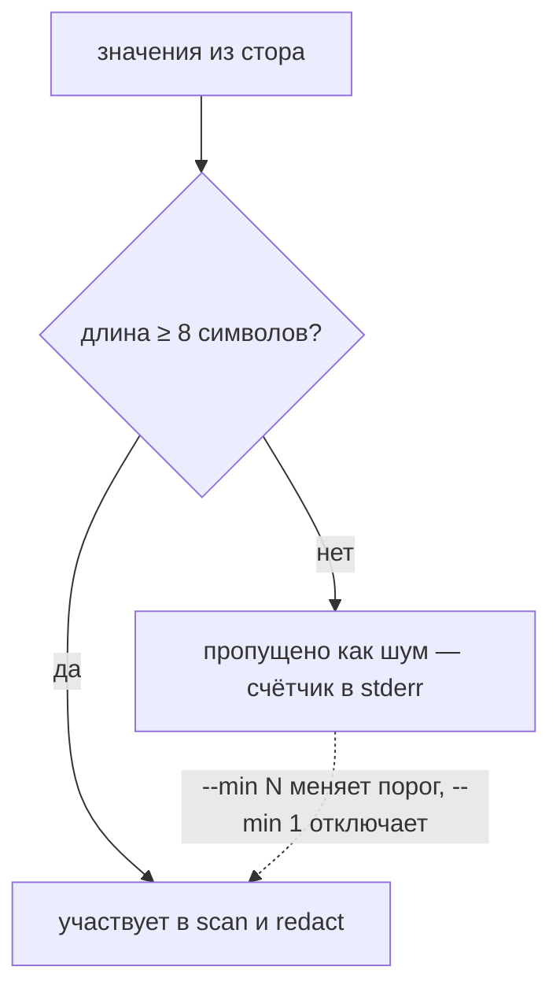

Три места в sec, где поведение выглядит неожиданным, пока не знаешь механики.
У них общий корень: **стор не знает, что за значение он хранит**. Для sec
секрет — это байты под именем. Путь это или содержимое файла, токен или
таймзона, длинная строка или номер месяца — различить он не может, и каждое из
трёх мест ниже разбирается с этим незнанием по-своему.

<div class="ok">Что поменялось по итогам разбора: <code>run</code> теперь
предупреждает, когда <code>--file</code> перекрывает одноимённый env-ключ;
в SKILL.md описаны приоритет <code>--file</code> и порог <code>--min</code>.
Семантика CLI прежняя — не хватало видимости, а не правильности.</div>

## 1. Файловые секреты: что именно кладётся в переменную

**Файловый секрет** — это содержимое файла, лежащее в сторе целиком:

```sh
sec set demo/GOOGLE_SERVICE_ACCOUNT --from-file creds.json   # kind: file
```

Потребляется он через `run --file`: sec разворачивает содержимое во временный
файл 0600, кладёт **путь** к нему в env-переменную и удаляет файл по выходу
команды. На диске секрет постоянно не живёт — это паттерн systemd
`LoadCredential`.

Отсюда главный вопрос: `--file` материализует **значение ключа**, поэтому всё
зависит от того, что в этом значении лежит.



Три формы записи различаются только тем, как назвать переменную и куда положить
файл:

| Форма | Что делает |
| --- | --- |
| `--file KEY` | содержимое `KEY` → временный файл, путь в переменной `KEY`. **Обычная форма** |
| `--file ENV=KEY` | то же, но переменная называется `ENV` — когда имя переменной диктует приложение, а ключ в сторе назван иначе |
| `--file KEY:путь` | положить не во временный каталог, а по конкретному пути |

### Откуда берётся путь, лежащий в сторе

Форма `ENV=KEY` в реальном сторе понадобилась вот почему. В пачке оказались
**два** ключа сразу: `GOOGLE_SERVICE_ACCOUNT` с JSON-содержимым и
`GOOGLE_SERVICE_ACCOUNT_FILE` со строкой-путём. Второй никто специально не
заводил — его затащил `sec import .env`: в исходном .env приложение
конфигурировалось строкой `GOOGLE_SERVICE_ACCOUNT_FILE=/Users/…/creds.json`, и
import взял её вместе со всем остальным.

<div class="warn">Такой ключ не просто бесполезен — он вреден: путь машинно-зависим,
а указывает он на плейнтекстовый файл с кредами, который вечно лежит на диске.
Ровно от этого файловые секреты и уводят.</div>



```sh
sec rm demo/GOOGLE_SERVICE_ACCOUNT_FILE                      # путь — не секрет
sec mv demo/GOOGLE_SERVICE_ACCOUNT demo/GOOGLE_SERVICE_ACCOUNT_FILE
sec run demo --file GOOGLE_SERVICE_ACCOUNT_FILE -- cmd       # без маппинга
```

`mv` не раскрывает значение и сохраняет историю — переносить ключ через
`get` + `set` не нужно.

### Коллизия имён: кто занимает переменную

Пока чистка не сделана, на одну переменную претендуют два источника: обычная
env-инъекция (значение `GOOGLE_SERVICE_ACCOUNT_FILE` из стора) и `--file`
(путь к временному файлу).



Приоритет у `--file` осознанный: явный флаг в команде — явное намерение, молча
отдать переменную значению из стора значило бы проигнорировать написанное
руками. Проблема была не в победителе, а в тишине — приоритет нигде не был
описан, и узнать его можно было только экспериментом. Теперь при коллизии
`run` печатает в stderr:

```
sec: env-ключ GOOGLE_SERVICE_ACCOUNT_FILE из стора перекрыт --file — в env уйдёт путь файла, не значение
```

В штатном случае (`--file KEY` без совпадения имён) предупреждения нет:
файловые ключи в обычную env-инъекцию и так не попадают, так что переменная
появляется ровно один раз.

## 2. Шум `sec scan` на несекретной конфигурации

`sec import` затаскивает `.env` целиком, поэтому рядом с настоящими секретами
в пачке живёт обычная конфигурация — таймзоны, имена листов, пути (тот самый
`GOOGLE_SERVICE_ACCOUNT_FILE` из первого раздела — из этой же породы). Для
стора они неразличимы: просто KEY=VALUE. А `sec scan` ищет в файлах **все**
сохранённые значения:



Репорт формально честный — сохранённое значение действительно встретилось в
файле. Но `Europe/Moscow` в `.env.example` и имя листа в README не утечки,
коммитить их нормально. Это ожидаемое следствие дизайна, а не баг: такие
находки фильтруются по смыслу, глушить из-за них scan не нужно.

<div class="note">Фича-кандидат на будущее: помечать такие ключи
<code>sec meta findler/TZ --kind config</code> — тогда scan и redact их
пропускают, а <code>run</code>/<code>export</code> продолжают инъектить, и шум
убирается у источника.</div>

## 3. Порог 8 символов в scan и redact (`--min`)

`scan` и `redact` ищут значения **подстрокой**. Короткое значение вроде `USD`,
`8080` или `7` совпало бы в каждом втором файле — вывод стал бы мусором.
Поэтому значения короче 8 символов обе команды пропускают: это грубая замена
знанию, секрет перед нами или нет.



Строка `пропущено значений короче 8 символов: N` печаталась всегда, но флаг
`--min` в скилле не упоминался — на пачках с короткими значениями (валюта,
номер месяца) это сбивало с толку. Если короткое значение — настоящий секрет
(PIN), нужен явный `--min 1`.

## Сводка

| Место | В чём подвох | Что делать |
| --- | --- | --- |
| `run --file` | материализуется **значение** ключа: строка-путь превратится во временный файл с текстом пути внутри | хранить содержимое файла (`set --from-file`), а не путь к нему |
| коллизия имён | `--file` перекрывает одноимённый env-ключ молча | теперь предупреждение в stderr; лучше — почистить пачку (`rm` пути + `mv`) |
| шум `scan` | стор не отличает секрет от конфига, попавшего в него через `import` | фильтровать находки по смыслу, scan не глушить |
| порог `--min` | значения короче 8 символов пропускаются | `--min 1`, если короткое значение — настоящий секрет |
