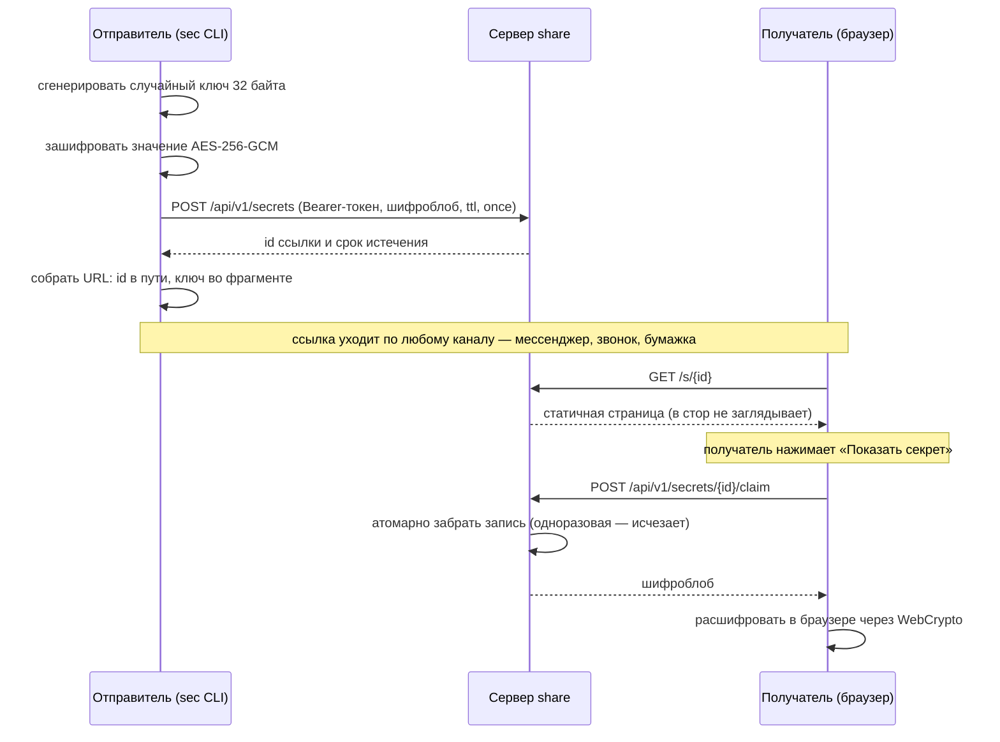
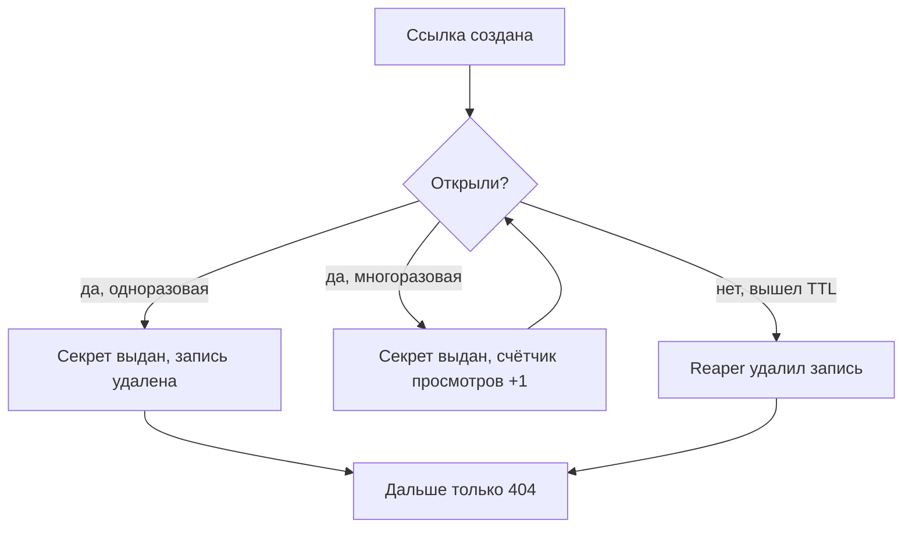

Передать коллеге пароль от базы — обыденная задача с неприятным свойством: любой
привычный канал (мессенджер, почта, тикет) хранит сообщение вечно и показывает его
всем, кто получит доступ к переписке. `sec share` решает это ссылкой, которая
живёт один просмотр или заданный срок, — и при этом устроен так, что **сервер
принципиально не может прочитать то, что через него передают**.

<div class="note">Прод-инстанс — <a href="https://share.kaidstor.ru">share.kaidstor.ru</a>,
исходники сервера — папка <code>server/</code> в репозитории sec. Сервер
self-hosted: поднять свой — один Go-бинарь без зависимостей.</div>

## Главная идея: ключ живёт в дырке от URL

Ссылка выглядит так:

```
https://share.kaidstor.ru/s/77dUJZuC9or7MDvIGfx1as#uKEOfa8-3TKVlM7EtxdYCq5hP3n5VCGkJ9oS5G1fcqo
                            └──────── id ────────┘ └────────────── ключ ──────────────────────┘
```

Всё после `#` — это **фрагмент URL**, и по устройству HTTP браузер его на сервер
не отправляет: фрагмент обрабатывается исключительно на клиенте. Поэтому 32-байтный
ключ расшифровки физически не попадает ни в запрос, ни в логи веб-сервера, ни в
базу — он существует только у отправителя (в момент создания) и у получателя
(в адресной строке).

Сервер хранит шифротекст, который без этого ключа бесполезен. Отсюда свойство,
ради которого всё и затевалось: скомпрометированный сервер, украденный диск или
любопытный админ не дают доступа к секретам. Это та же схема, что у PrivateBin и
Firefox Send, — «zero-knowledge» в буквальном смысле: узел, через который идёт
передача, ничего не знает о содержимом.

## Поток целиком



Обратите внимание на два разделённых шага в конце: страница отдаётся отдельно от
секрета. Это не случайность, а защита — см. ниже.

## Криптография

| Что | Как |
| --- | --- |
| Шифр | AES-256-GCM |
| Ключ | 32 случайных байта из CSPRNG, **свой на каждую ссылку** |
| Nonce | 12 случайных байт, уникален на блоб |
| Целостность | GCM-тег плюс аутентифицированный заголовок (AAD) |
| Ключ в URL | base64url без паддинга — 43 символа |
| id | 16 случайных байт → Base62, 21–22 символа |

Формат блоба, который уходит на сервер:

```
"secshare" | 0x01 | nonce(12) | ciphertext + GCM-тег
└──── AAD (9 байт) ────┘
```

Магия и версия входят в AAD — подменить версию или подсунуть чужой заголовок не
получится, GCM это заметит. Внутри шифротекста лежит JSON-конверт с типом
(`text`/`file`), содержимым и — для файлов — исходным именем и правами. То есть
даже **имя файла сервер не видит**: `server.p12` зашифрован ровно так же, как его
содержимое.

Отдельная причина выбрать AES-GCM, а не XChaCha20-Poly1305, которым зашифровано
само хранилище sec: расшифровка должна работать в браузере получателя без единой
внешней библиотеки, а WebCrypto из AEAD-шифров умеет только AES-GCM.

<div class="warn"><b>Грабля, которую легко посадить:</b> совместимость Go ↔ WebCrypto
не проверяется обычными round-trip-тестами — перестановка байтов в AAD или смена
раскладки nonce пройдёт все Go-тесты и молча сломает расшифровку в браузере.
Поэтому в тестах лежит пиненый golden-вектор (ключ + блоб + ожидаемый результат):
он и есть контракт между двумя реализациями.</div>

## Жизнь ссылки: одноразовость и TTL

Ссылка гасится по первому из двух событий — открытию или истечению срока:



По умолчанию — одноразовая с TTL 24 часа: страховка на случай, если получатель
так и не открыл ссылку. `--multi` делает её многоразовой в пределах TTL (1 час…7 дней).

**Одноразовость обязана быть атомарной**, иначе два одновременных запроса получат
секрет оба. Забор реализован через `os.Rename` файла записи: переименование в
пределах файловой системы атомарно, поэтому побеждает ровно один запрос, а
проигравшие получают ENOENT и честный 404. Это работает и при деплое, когда
секунду-другую живут два контейнера над одним томом. В тестах гонку караулят
32 горутины, дерущиеся за один секрет: успех должен быть строго один.

## Почему секрет отдаётся по клику, а не сразу

Самая обидная поломка одноразовых ссылок — превью-боты. Вставляешь ссылку в
мессенджер, тот идёт по ней строить карточку предпросмотра, ссылка сгорает,
человек получает 404. То же самое делают антивирусные шлюзы в корпоративной почте.

Поэтому `GET /s/{id}` **никогда не трогает хранилище** — отдаёт статичную страницу,
даже не проверяя, существует ли такая ссылка. Секрет забирается отдельным
`POST /claim`, который делает JavaScript по нажатию кнопки. Бот кнопок не нажимает.

Побочная выгода: раз страница отдаётся всегда, по ней нельзя проверить,
существует ли ссылка, — оракула для перебора нет. И сам перебор бессмыслен:
в id 128 бит случайности.

## Кто может создавать, кто — читать

Асимметрия намеренная:

<div class="cards">
  <div class="card"><h4>Создание — по токену</h4>Bearer-токен выпускается только на
  сервере командой <code>sec-share token add &lt;имя&gt;</code>. HTTP-эндпоинта для
  выпуска нет, регистрации нет — нужен доступ к хосту.</div>
  <div class="card"><h4>Чтение — по ссылке</h4>Никакой авторизации: у кого ссылка,
  тот и прочитал. Ограничивают доступ одноразовость и TTL, а не логин.</div>
</div>

Токенов может быть несколько именованных (рабочая машина, ноутбук, коллега),
каждый отзывается отдельно и видит только свои ссылки. В файле на сервере хранятся
**только SHA-256-хэши** — сам токен показывается один раз при выпуске; сравнение
идёт в константное время. У токена есть квота (100 активных ссылок), чтобы утёкший
токен не забил диск.

Локально пара «адрес + токен» лежит в зашифрованном хранилище самого sec, под
служебным проектом `_share`, имя которого специально не проходит валидацию имён
проектов — значит, ни одна обычная команда его случайно не затронет.

## Что в итоге видит сервер

| Видит | Не видит |
| --- | --- |
| размер шифротекста | значение секрета |
| время создания и открытия | имя ключа (`proj/KEY`) |
| IP получателя | имя и права переданного файла |
| имя токена-создателя | ключ расшифровки |

Локальный журнал sec (`sec log`) пишет только адрес ключа, хост, id и TTL —
фрагмент с ключом в него не попадает никогда.

<div class="warn"><b>Главное ограничение модели:</b> URL целиком — это и есть
секрет. Канал, по которому вы отправляете ссылку, надо выбирать так же
ответственно, как если бы отправляли сам пароль; одноразовость и TTL лишь
сокращают окно, в которое утечка переписки опасна. Соответственно и
<code>sec share revoke</code> лучше кормить коротким id, а не полным URL, —
иначе ключ осядет в истории shell.</div>

## Как этим пользоваться

```bash
sec share whois/DB_PASSWORD                    # одноразовая ссылка, TTL 24 часа
sec share infra/server.p12 --ttl 3d            # файловый секрет — получатель скачает файл
openssl rand -hex 32 | sec share -             # значение со stdin, в хранилище не попадает
sec share --file ~/kube.yaml --multi --ttl 7d  # файл с диска, многоразовая
sec share ls                                   # свои активные ссылки
sec share revoke <id>                          # погасить досрочно
```

Ссылка печатается в stdout (удобно подставлять в переменную) и **сразу копируется
в буфер обмена**; пояснение про режим и срок уходит в stderr. Отключить копирование —
`--no-clip`.

Подключение к серверу разовое:

```bash
ssh my-vpn docker exec sec-share sec-share token add kai   # выпустить токен
sec share setup https://share.kaidstor.ru                  # токен вводится скрыто
```

<div class="ok">Работает на share.kaidstor.ru: сервер за traefik с Let's Encrypt,
непривилегированный контейнер, данные — обычные файлы в томе. Потеря тома означает
лишь, что активные ссылки перестанут открываться: утечки не происходит, потому что
без ключей из фрагментов шифротексты бесполезны — поэтому том сознательно не
бэкапится.</div>
